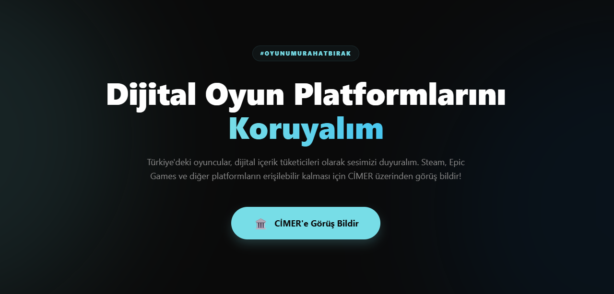

# #OyunumuRahatBırak

[](https://livezival.github.io/oyunumurahatbirak/)

### Dijital Oyun Platformlarını Koruyalım
Türkiye'deki oyuncular, dijital içerik tüketicileri olarak sesimizi duyuralım. Steam, Epic Games ve diğer platformların erişilebilir kalması için CİMER üzerinden görüş bildir!

İsterseniz sayacı artırmak için [oyunumadokunma.com](https://oyunumadokunma.com) üzerinden imza da verebilirsiniz.

---

### CİMER Başvuru Rehberi
Sesini duyurmak için aşağıdaki adımları takip et.
1. Aşağıdaki resmi dilekçe metnini butona basarak kopyalayın.
```
Sayın Yetkili,

Son dönemde kamuoyuna yansıyan dijital oyun platformlarına yönelik bant daraltması ve yerel temsilci zorunluluğu gibi düzenleme taslaklarını yakından takip etmekteyim. Bir Türkiye Cumhuriyeti vatandaşı ve dijital içerik tüketicisi olarak, bu tür kısıtlayıcı önlemlerin ülkemizdeki milyonlarca oyuncunun yanı sıra gelişmekte olan yerli oyun geliştirme ekosistemini de olumsuz etkileyeceğinden derin endişe duymaktayım.

Dijital oyun mağazalarına erişimin teknik yöntemlerle zorlaştırılması, kullanıcıların yasal yollarla satın almış oldukları kütüphanelerine erişimini engelleyeceği gibi; bilgi teknolojileri ve dijital ekonomi alanındaki küresel entegrasyonumuza da zarar verme riski taşımaktadır. Özellikle genç nüfusun en büyük sosyalleşme alanı olan bu platformların kısıtlanması, dijital özgürlükler ve hizmete erişim hakkı bağlamında büyük mağduriyetler yaratacaktır.

Söz konusu düzenlemelerin; serbest piyasa ekonomisi, kullanıcı hakları ve teknolojik gerçeklikler göz önünde bulundurularak yeniden değerlendirilmesini; bant daraltma gibi cezai yöntemler yerine yapıcı çözümler üretilmesini arz ederim.

Saygılarımla.
#OyunumuRahatBırak
```
2. [CİMER'e giderek](https://www.cimer.gov.tr/) kopyaladığınız metni yapıştırıp başvurunuzu gönderin.

---

### 🛒 Dijital Mağazalar
- Steam
- Epic Games
- Ea App
- GOG
- PlayStation
- Xbox
- BattleNet
- Ubisoft Connect
- Rockstar Games
ve dahası...

---

### ℹ️ Ne Oluyor?
#### 📄 Yeni Düzenleme Taslağı
Bakanlık tarafından hazırlanan yeni düzenleme, platformların yerel temsilci bulundurmasını zorunlu kılıyor.

#### ⚠️ Olası Yaptırımlar
Şartları sağlamayan platformlara %90'a varan bant daraltması uygulanabilir.

#### 🚫 İçerik Kısıtlamaları
Sakıncalı bulunan oyunların mağazalardan kaldırılması talep edilebilecek.

#### 👤 Yaş Sınıflandırması
Sınıflandırma yapılmayan oyunların satışına izin verilmeyecek.

---

### ❓ Sıkça Sorulan Sorular
- Neden CİMER'e yazmalıyım?
  - CİMER, vatandaşların görüşlerini doğrudan devlet kurumlarına iletebildiği en etkili kanaldır. Çok sayıda benzer başvuru, konunun gündeme alınmasını sağlar.
- Hangi kurumu seçmeliyim?
  - Başvuru sırasında muhatap kurum olarak 'Aile ve Sosyal Hizmetler Bakanlığı', 'Bilgi Teknolojileri ve İletişim Kurumu' veya 'İletişim Başkanlığı'nı seçebilirsiniz.
- Metni değiştirebilir miyim?
  - Elbette. Kopyaladığınız metni kendi cümlelerinizle daha detaylı hale getirmeniz etkinizi artırabilir.

---

© 2026 #OyunumuRahatBırak

Tüm hakları saklıdır.
